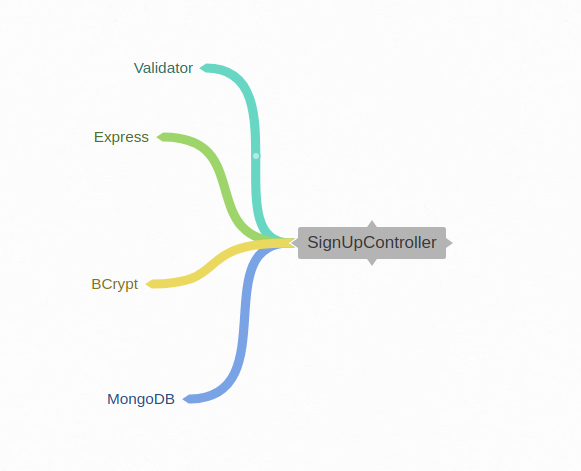
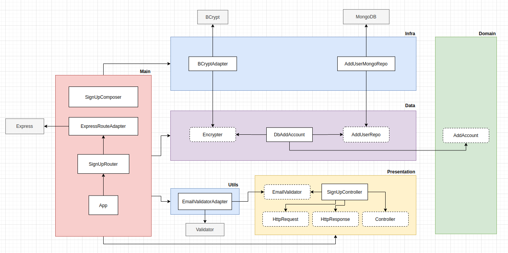

# clean-architecture-study
:shower: A deep study about the best programming practices and design patterns (such as TDD, DDD, Clean Architecture and SOLID) with help of Node.js

<p align="center">
	<a href="https://travis-ci.org/guilhermebkel/clean-node">
		
	</a>
	<a href="https://coveralls.io/github/guilhermebkel/clean-node?branch=master">
		
	</a>
</p>

**Principles**
* Single Responsibility Principle (SRP)
* Open Closed Principle (OCP)
* Liskov Substitution Principle (LSP)
* Interface Segregation Principle (ISP)
* Dependency Inversion Principle (DIP)
* Separation of Concerns (SOC)
* Don't Repeat Yourself (DRY)
* You Aren't Gonna Need It (YAGNI)
* Keep It Simple, Silly (KISS)
* Composition Over Inheritance
* Small Commits

**Design Patterns**
* Factory
* Adapter
* Composite
* Decorator
* Proxy
* Dependency Injection
* Abstract Server
* Composition Root
* Builder

## Summary

- [ Clean architecture ](#clean-architecture)
- [ Test driven development ](#test-driven-development)
- [ Best coding practices ](#best-coding-practices)
- [ Design Pattern Decorator ](#design-pattern-decorator)
- [ Design Pattern Composite ](#design-pattern-composite)
- [ Step By Step ](#step-by-step)

<a name="clean-architecture"></a>

## Clean architecture

When we're attempting to create an app, we can easily make it coupled by doing the following:



But the question is: **Why is that coupled?**

The response is: **You're making a direct connection between lots of important parts of your project, without any boundaries between them. Because of this, if you decide to change some of these parts later, it will be hard since you'll have to make a change in everything that is coupled.**

In order to avoid coupling all the software, we have lots of ways to make it. One of them is called **Dependency Inversion**, which make us able to add **Layers** between external libraries and the core of our project, as the name says by itself, we make the libs to rely on our project, not the contrary.



In the picture above, you can see that we separated our architecture in the following layers:

- Main: All the core base to make the app to work.
- Utils: Tools to help with sanitization, validation, etc.
- Presentation: Our client, usually the stuffs that are closer to user.
- Domain: All business logic.
- Data: Everything that deals with databases.
- Infra: Stuffs that deals with infrastructure tools.

Despite of being a complex architecture, we're able to decouple all the external libraries of our project, being able to easily change them when needed.

<a name="test-driven-development"></a>

## Test driven development

When we talk about TDD, we need to make sure that its main idea is going to be practiced:

> Start by making the test to fail
>
> Make the less as you can to succeed the test
> 
> Improve the code by refactoring it
>
> **Make it all again till you finish the feature!**

Besides, when we're dealing with tests, way too much often we'll need to fake some data or even actions to test our software. When making it, we need to ensure we're not coupling the tests with already made features of our project. Below you can see an example:

Suppose that you're going to test a class called **SignUpController** and it uses a **Validator** via dependency injection.

```ts
/**
 * Wrong way to do it, since you're coupling with
 * something outside.
 **/

import EmailValidator from "../validators/EmailValidator"

const signUpController = new SignUpController(EmailValidator)
```

```ts
/**
 * Correct way. Looses coupling and uses the same
 * signature of "EmailValidator" class, making sure
 * we're using almost the same production class.
 **/

import { IEmailValidator } from "../validators/EmailValidator"

class EmailValidatorStub implements IEmailValidator {
	isValid() {
		return true
	}
}

const signUpController = new SignUpController(EmailValidatorStub)
```

Some concepts are really important to know when faking data:

1. Stub: A method that implements the same signature of the production one (the difference is that it returns the same value everytime), what means that you'll have no surprises all the way long, while testing without coupling your system.

2. Spy: A method implemented by the test framework, used to stalk methods and changes the data returned by them (usually used when you have a method returning everytime the same value but in some tests you expect another).

3. Mock: Usually static data that you'll consume on your tests.

<a name="best-coding-practices"></a>

## Best coding practices

Please be minded that the following practices can sometimes not be followed exactly how they we're expected to be, since sometimes you'll come up with some exceptions. Despite of that, they keep being good practices to try to follow when you can, since they help you loosing coupling and avoiding side effects on your application.

1. A method should own a single responsability
```ts
/**
 * Usually not the best way since as the name suggests,
 * it was only made to sum numbers.
 **/
function sum(firstNumber, secondNumber) {
	const doubledFirstNumber = firstNumber * 2

	return doubledFirstNumber + secondNumber
}

/**
 * Usually the correct way.
 **/
function sum(firstNumber, secondNumber) {
	return firstNumber + secondNumber
}
```

<a name="design-pattern-decorator"></a>

## Design Pattern Decorator

Sometimes we'll need to add dependencies to our factories without needing to pass it inside them. One of the ways to do that is by implementing the **Decorator** pattern.

This pattern consists in adding a **Outer Layer** that embraces a **Main Layer**.

Suppose that we have a **Controller** and we want to implement a **Logger** around that:
```ts
interface IController {
	handle(): Promise<{ success: boolean } | { error: Error }>
}

class Controller implements IController {
	async handle() {
		try {
			return { success: true }
		} catch(error) {
			return { error }
		}
	}
}

class LogControllerDecorator implements IController {
	private readonly controller: IController

	constructor(controller: IController) {
		this.controller = controller
	}

	async handle() {
		const result = await this.controller.handle()

		if (result.error) {
			console.log(`We're wrapping around Controller: ${result.error.message}`)
		}

		return result
	}
}

const controller = new Controller()
const logControllerDecorator = new LogControllerDecorator(controller)

logControllerDecorator.handle()
```

<a name="design-pattern-composite"></a>

## Design Pattern Composite

Sometimes we'll create some services that need to be replicated all around the application.

One example can be a **Validation**, since we can make the following validations: **Email, Missing Param, Invalid Param, etc...**.

To improve this scalability to be done all around the application, we can use the **Design Pattern Composite** that consists in a **Main Factory** that receives another **Factories** to accomplish a single responsability.

```ts
interface Validation {
	validate(input: any): Error
}

class ValidationComposite implements Validation {
	private readonly validators: Validation[]

	constructor(validators: Validation[]) {
		this.validators = validators
	}

	validate(input: any) {
		for (const validator of this.validators) {
			const error = validator.validate(input)

			if (error) {
				return error
			}
		}
	}
}

class RequiredParamValidation implements Validation {
	private readonly inputField: string

	constructor(inputField: string) {
		this.inputField = inputField
	}

	validate(input: any) {
		if (!input[this.inputField]) {
			return new Error(`Param not supplied: ${this.inputField}`)
		}
	}
}

class IsNumberValidation implements Validation {
	private readonly inputField: string

	constructor(inputField: string) {
		this.inputField = inputField
	}

	validate(input: any) {
		if (isNaN(+input[this.inputField])) {
			return new Error(`Not a number: ${this.inputField}`)
		}
	}
}

const requiredParamValidation = new RequiredParamValidation('name')
const isNumberValidation = new IsNumberValidation('phone')

const validationComposite = new ValidationComposite([
	requiredParamValidation,
	isNumberValidation
])

validationComposite.validate({
	name: 'any_name',
	phone: 123456789
})
```

<a name="step-by-step"></a>

## Step By Step

A good step by step to follow when building TDD Tests is:
1. Create the UseCase
2. Create the Test File for the class that will implement the UseCase
3. Start creating failing tests
4. Create the production class that implements the UseCase
5. Create the mocks if needed (making sure the mock return will be hard coded to be successful with no spies)
6. Create protocols for mocks if needed
7. Finalize tests (try to test all core features)
8. Refactor tests (add factories, remove code duplications, etc.)
