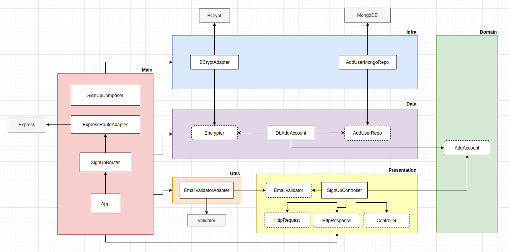

# clean-node
:shower: A deep study about the best programming practices and design patterns (such as TDD, Clean Architecture and SOLID) with help of Node.js

## Summary

- [ Clean architecture ](#clean-architecture)

## Clean architecture

When we're attempting to create an app, we can easily make it coupled by doing the following:

But the question is: **Why is that coupled?**

The response is: **You're making a direct connection between lots of important parts of your project, without any boundaries between them. Because of this, if you decide to change some of these parts later, it will be hard since you'll have to make a change in everything that is coupled.**

In order to avoid coupling all the software, we have lots of ways to make it. One of them is called **Dependency Inversion**, which make us able to add **Layers** between external libraries and the core of our project, as the name says by itself, we make the libs to rely on our project.

In the picture above, you can see that we separated our architecture in the following layers:

- Main: All the core base to make the app to work.
- Utils: Tools to help with sanitization, validation, etc.
- Presentation: Our client, usually the stuffs that are closer to user.
- Domain: All business logic.
- Data: Everything that deals with databases.
- Infra: Stuffs that deals with infrastructure tools.

Despite of being a complex architecture, we're able to decouple all the external libraries of our project, being able to easily change than when needed.